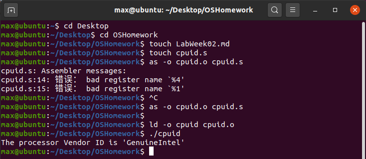
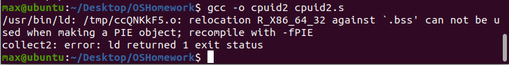
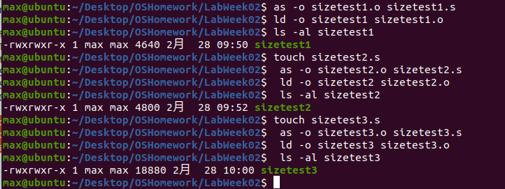
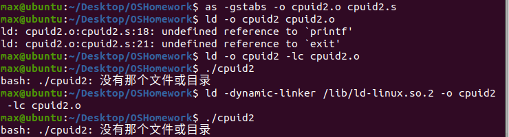
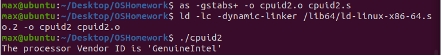

# 实验验证

实验验证内容索引

[实验1：squid.s](#ex1)

# 技术日志

## 第四章

本章学习的是GNU汇编器的基本汇编语言程序模板。

### 4.1 程序的组成

目标：学习汇编语言程序中的通用项目，以及如何使用它们定义的通用模板。

1. 汇编语言程序由定义好的段构成，常用的段有**数据段**，**BSS段**，和**文本段**，其中文本段是可执行程序声明指令码的地方，数据段声明数据，BSS段声明使用null值初始化的数据元素，常做缓冲区。

2. 定义段的方法：GNU汇编器使用**\.section**命令语句声明段，如下：

		.section.data
		.section.bss
		.section.text
	
3. 起始点的定义：为了让连接器知道指令代码的开始位置，**_start**标签用于表明程序应该从这条指令开始运行。除了起始标签，还需要通过**\.globl**(不是golbal)为外部应用程序提供入口点，这个命令声明了外部程序可以访问的程序标签，如果编写的是为外部程序使用的一组工具，应使用此命令声明每一个函数锻标签。例子如下：

		.section.text
		.globl _start
		_start:
		#代码
	
### 4.2 简单程序 cpuid.s

4. CPUID指令：请求处理器的特定信息并且把信息返回到特定寄存器中，它使用单一寄存器值作为输入。EAX寄存器用于决定CPUID指令生成什么信息，根据此在EBX，ECX，EDX上生成关于处理器的信息。
	
程序目的：使用0选项从处理器获得简单的厂商ID字符串，字符串返回在EBX（包含最低4个字节），EDX（中间四个），ECX（最高四个）中。注意，字符串的第一部分放在寄存器的低位中。

汇编，连接和运行：

	as -o cpuid.o cpuid.s
	ld -o cpuid cpuid.o
	./cpuid

实验截图： 

使用编译器进行汇编：**需要把_start改成main**

	gcc -o cpuid cpuid.s
	./cpuid

### 4.3 调试程序

5. 使用GNU调试器检查程序，监视处理过程中寄存器和内存位置的改变。

 **使用gdb**：其中gstabs在可执行文件中添加了附加调试信息。

	as -gstabs -o cpuid.o cpuid.s
	ld -o cpuid cpuid.o

 **单步运行程序**
	
	gdb cpuid
	run (使用run命令从gdb中运行程序)
	
 **设置断点**：某个标签/行号/数据到达特定值/函数执行指定次数。
 
 break命令格式：break * label + offset
 
	break * _start
	run (程序暂停在第一条指令处，使用next或者step进行单步调试，或者使用cont命令使程序按照正常方式继续运行。

 **查看数据**
 
 |数据命令|描述|
 |---|---|
 |info registers|显示所有寄存器的值|
 |print|显示特定寄存器或来自程序的变量的值|
 |x|显示特定内存位置的内容|
 
 其中，print可以加上修饰符制定输出格式： /d显示十进制 /t二进制 /x十六进制
 
	print/x $ebx
 
 x的格式： x/nyz ，其中n是显示的字段数，y是输出格式(c字符,d十进制,x十六进制)，z是显示的字段长度(b 字节, h 16位半字节, w 32位字)
 
	x/42cb &output
	
### 4.4 在汇编中使用C库函数 cpuid2.s

6. 在程序中，我们在bss申请了12个字节的缓冲区buffer，(.lcomm buffer 12)我们使用call指令调用C函数，通过pushl以此押入$buffer和$output，最后还原栈。 

使用动态连接的方法：在程序运行时由操作系统调用动态连接库。

  使用ld：(需将main改为_start)

	as -gstabs+ -o cpuid2.o cpuid2.s
	ld -lc -dynamic-linker /lib64/ld-linux-x86-64.so.2 -o cpuid2 cpuid2.o
	./cpuid2

  使用gcc：(需将_start改为main)

	gcc -o cpuid2 cpuid2.s
	./cpuid2

编译报错（未解决）： 

## 第五章

*本章学习如何使用汇编语言处理数据。学习过程：先遵循Blum的书（32位汇编语言）学完，在根据 www.egr.unlv.edu/~ed/assembly64.pdf （64位汇编）来修正学习内容*。

### 5.1 定义数据元素

7. 在数据段（.data）中定义：

 定义数据需要**标签和命令**，标签是汇编器试图访问内存位置時用作引用指针的一个位置，命令说明为数据保留多少字节（数据类型和数据项目的数量），声明定义后，**必须定义初始值**。
 
 常见的命令有： 
 
 	.ascii 文本字符串
 	.asciz 以空字符结尾的文本字符串
 	.byte 字节值
 	.int 32位整数
 	.double 双精度浮点数
 	.float 单精度浮点数
 	
 几个例子：
 
 	output:
 	.ascii "Hello World\n" 
 	#这个代码片段留出12字节内存，把定义的字符串顺序存放在内存字节中，标签output赋为第一个字节
 	
 	pi:
 	.float 3.14159
 	
 	sizes:
 	.long 100, 150, 200
 	#类似数组，把三个四字节的长整数放在从sizes引用开始的内存位置中。我们可以通过访问内存位置size+8来访问值150。（32位，**待测试**在64位是否成立）
 	
内存地址**从低到高**存放元素。

8. 定义**静态符号**：

.equ命令用于将常量值设置为可以在文本段中使用的符号

	.equ factor, 3
	.equ LINUX_SYS_CALL, 0x80
	
通过加**$**引用静态元素数据，如

	movl $LINUX_SYS_CALL, %eax
	#把0x80赋值给eax寄存器
	
9. 在**.bss段**中定义：声明无需指定数据类型，只需声明所需的原始内存。 .comm 和 .lcomm 都用于声明未初始化的数据的通用内存区域，区别在于后者声明的是本地内存区域（是不会从本地汇编代码之外进行访问的数据保留的）

	.lcomm buffer, 1000
	#把1000字节的内存区域赋值给buffer标签，在本地通用内存区域的程序之外不能访问它（不能在.globl命令中使用它）
	
**测试**：sizetest1.s , sizetest2.s 和 sizetest3.s 测试.bss段申请的空间不包含在可执行程序中

测试结果：

我们可以看到sizetest1.s（没有申请bss段的程序）和sizetest2.s（申请了bss段的程序）大小差别不大（分别是4860和4800字节），试验结果得到**.bss段申请的空间不包含在可执行程序中**，而sizetest3.s（在数据区申请了10000字节的程序）的大小是18800字节，显然包含了数据区所申请的10000字节。

---

# 问题和解决

## 问题1：PUSHL指令在64位x86中不适用

解决方案1：将PUSHL改为PUSHQ。

解决方案2：

	pushq $buffer
	pushq $output
	
	改为：
	
	lea output(%rip), %rdi 
	lea buffer(%rip), %rsi

## 问题2：C库函数的动态链接

我怀疑是因为动态连接库的名称或相对地址不对。

编译报错： 

解决方案：对程序部分进行了修改(即采用了问题1的解决方案2)，并找到动态库 /lib64/ld-linux-x86-64.so.2

正确运行：
   
参考：https://blog.csdn.net/FreeeLinux/article/details/85147455

不清楚报错原因。

编译报错： 

