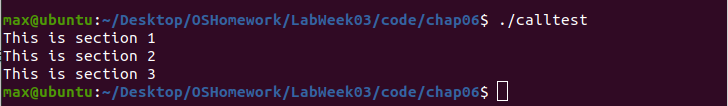
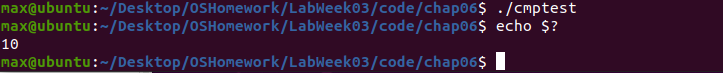
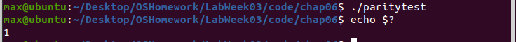
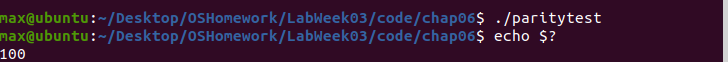
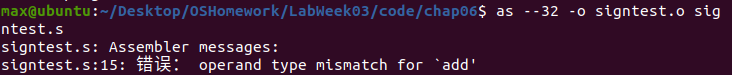
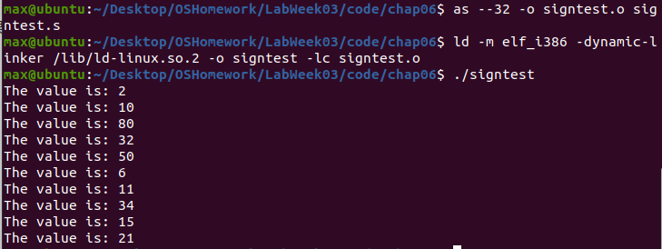
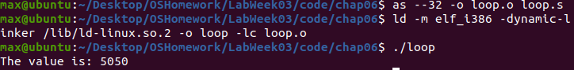
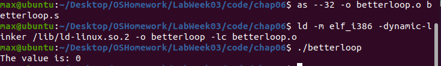
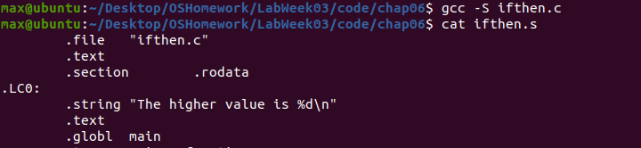
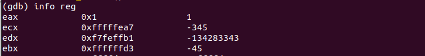

# Lab Week03 - 验证实验 Blum’s Book: Sample programs in Chapter 06, 07 

**郑有为 19335286**

如果图片或链接显示异常，请访问 [OSHomework-LabWeek03.md](https://github.com/WondrousWisdomcard/OSHomework/blob/main/LabWeek03/LabWeek03.md) 。我把代码和截图都放在了仓库 [OSHomework](https://github.com/WondrousWisdomcard/OSHomework)。

[toc]

# 实验验证

## 实验验证内容索引

[实验1. 测试jmp - jumptest.s](#ex1)

# 技术日志

## 第六章 控制执行流程

本章学习的是用于进行跳转和循环的不同汇编语言指令。

### 6.1 指令指针EIP

1. 分支指令，分支指令包括有条件和无条件改动，可以改动寄存器EIP的值，其中EIP是指令指针寄存器，EIP不可以被mov指令更改。

### 6.2 无条件分支

2. 可以使用无条件分支的有：**跳转、调用、中断**。

	* 跳转：其中location是要跳转到的内存地址。
	
		jmp location
		
	
	
	测试jmp指令 - jumptest.s实验测试：
	
	实验截图： 
	
	使用jumptest反汇编，反汇编器显示每条指令将使用的内存位置：
	
	实验截图： 
	
	我们使用gdb调试观察指令指针的变化，比较特殊的是在64位操作系统上我们应该使用寄存器rip来获取指令指针，可以看到jmp指令使指令指针跳转到了mov $0x14,%ebx那行：
	
	实验截图： 
	
	* 调用：调用保存发生跳转的位置，并且他具有在需要的时候返回这个位置的能力。
	
	用函数可以编写划分区域的代码，把不同的功能划分为不同的段落，调用指令分为两部分：
	
		call address
		#address是引用程序的标签。
		
		ret
		#返回指令
		
	当call执行时，它把eip寄存器的值放到了**堆栈**中，然后修改eip寄存器指向被调用的函数地址。当函数开始时，通常把esp寄存器复制到ebp寄存器中，然后使用ebp寄存器值获得call指令之前传递给堆栈的信息，并且为本地数据存储把变量存在堆栈中。
	
	
	
	测试call指令 - calltest.s实验测试： 
	
	as --32 -o calltest.o calltest.s
	ld -m elf_i386 -dynamic-linker /lib/ld-linux.so.2 -o calltest -lc calltest.o
	./calltest
	
	实验截图： 
	
	
	* 中断：中断是处理器停止当前指令路径并切换到不同路径的方式，分为软件中断和硬件中断。
	
	带有0x80的int指令就是把控制转移给Linux系统调用程序。
	
### 6.3 条件分支：条件分支是否跳转取决与eflags寄存器的状态（进位，溢出，符号，奇偶校验，零）

	* 条件跳转指令： 
	
		#用于无符号数
		ja address #above
		jae address #above or equal
		jb address #below
		jbe address #below or equal
		
		jc address #carry
		jecxz address #ecx is zero
		
		#用于有符号数
		je address #equal
		jg address #greater
		jge address #greater or equal
		jl address#less
		jle address #less or equal
		#...
		
	* 比较指令：对操作数进行减法操作，op2-op1，根据结构修改寄存器，与条件跳转指令组合使用。
	
		cmp operand1, operand2
		
	
	
	测试cmp指令 - cmptest.s实验测试： 
	
	实验截图： 
	
	可以看到，由于eax的值大于ebx的，也即ebx-eax小于0,没有跳转到greater去，最终eax寄存器的值还是10。
	
	* 使用标志位：
	
	**零标志位**：如果零标志位被值为1,即两个操作数相等，je和jz指令就会跳转到分支。零标志位可以由cmp设置，也可以通过结果为零的数学指令设置：
	
		movl $20, %eax
		subl $20, %eax
		jz overthere
		#会跳转
		
	**溢出标志位**：当带符号值溢出时，溢出标志位被置为1.
	
		movb $0x7f, %bl
		add $10, %bl
		jo overthere
		#会跳转	
		
	**奇偶校验位**：若结果中1的位数是偶数，则校验位被置为1。
	
	
	
	测试奇偶校验位指令 - paritytest.s实验测试：
	
	实验截图： 
	
	随后改变sub一行：subl $1, %ebx,对应应导致jp跳转到overhere标签，结果为100.
	
	实验截图： 
	
	**符号标志**：在带符号数中，最高位用作符号位，负数置1.
	
	
	
	测试奇偶校验位指令 - signtest.s实验测试：
	
	执行源程序的过程报错：
	
	实验截图： 
	
	考虑删除add $8, $esp一行，得到正确输出：
	
	实验截图： 
	
	**进位标志**：表示无符号数溢出，inc，dec指令不影响进位标志，而addl会。
	
		clc #清空进位标志
		cmc #进位标志取反
		stc #置进位标志为1
		
### 6.4 循环

	* loop指令：循环直到ecx寄存器为0，loop会自动递减ecx的值。除此之外，LOOPE，LOOPZ LOOPNE LOOPNZ提供了监视零标志位的附加功能。
	
		loop address
		#loop指令只支持address的8位偏移量，即短跳转。
		
	span id = "ex6">
	
	测试循环指令loop - loop.s实验测试：
	
	实验截图： 
	     
	求得 1+2+3+...+100 = 5050
	
	* 注意： 当执行loop指令时，它是先将ecx递减1,再判断是否等于0。若ecx = 0,则会出现疯狂地循环。但是我们可以通过jcxz指令规避错误，即如果ecx的值为0,就使用jcxz指令执行条件分支。
	
	span id = "ex7">
	
	优化循环指令测试 - betterloop.s实验测试：
	
	实验截图： 
	
### 6.5 模仿高级条件分支：if和for

	使用gcc对ifthen.c程序进行汇编，并分析代码：
	
	实验截图： 

		#if
		if:
			<condition to evaluate>
			jxx else
		<code to implement then startment>
		jmp end
		else:
		<code to implement else startment>
		end:
		
	使用gcc对for.c程序进行汇编：
	
	实验截图： 
		
		#for
		for:
			<condition to evaluate for loop counter value>
			jxx forcode
			jmp end
		forcode:
			<for loop code to excute>
			<increment for loop counter>
			jmp for
		end:
		
### 6.6 优化分支指令

	分支预测，消除分支（配合cmov/cmpl/...和jxx)，首先编写可预测分支的代码（把最可能采用的代码安排在向前跳转的顺序执行指令中），展开循环。
	
	
## 第七章 使用数字

本章学习的是不同的数字格式和使用方法。

### 6.1 指令指针EIP
# 问题和解决

## 问题1：

**解决方案1**：

--- 
