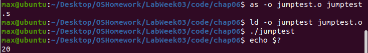
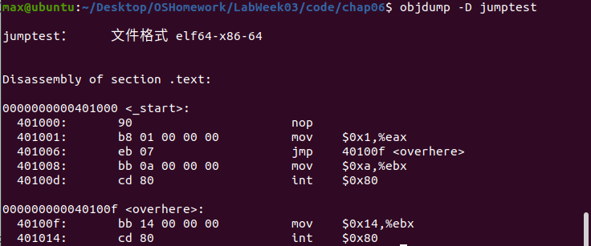
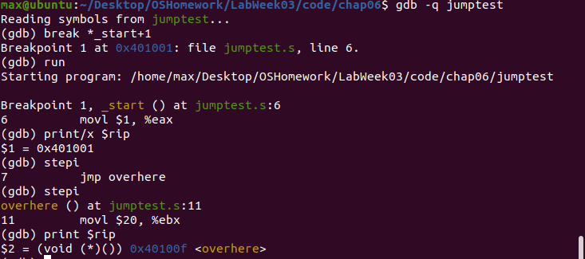

# Lab Week03 - 验证实验 Blum’s Book: Sample programs in Chapter 06, 07 

**郑有为 19335286**

如果图片或链接显示异常，请访问 [OSHomework-LabWeek03.md](https://github.com/WondrousWisdomcard/OSHomework/blob/main/LabWeek03/LabWeek03.md) 。我把代码和截图都放在了仓库 [OSHomework](https://github.com/WondrousWisdomcard/OSHomework)。

[toc]

# 实验验证

## 实验验证内容索引

[实验1. 测试jmp - jumptest.s](#ex1)

# 技术日志

## 第六章 控制执行流程

本章学习的是用于进行跳转和循环的不同汇编语言指令。

### 6.1 指令指针EIP

1. 分支指令，分支指令包括有条件和无条件改动，可以改动寄存器EIP的值，其中EIP是指令指针寄存器，EIP不可以被mov指令更改。

### 6.2 无条件分支

2. 可以使用无条件分支的有：**跳转、调用、中断**。

	* 跳转：其中location是要跳转到的内存地址。
	
		jmp location
		
	
	
	测试jmp指令 - jumptest.s实验测试：
	
	实验截图： 
	
	使用jumptest反汇编，反汇编器显示每条指令将使用的内存位置：
	
	实验截图： 
	
	我们使用gdb调试观察指令指针的变化，比较特殊的是在64位操作系统上我们应该使用寄存器rip来获取指令指针，可以看到jmp指令使指令指针跳转到了mov $0x14,%ebx那行：
	
	实验截图： 
	
# 问题和解决

## 问题1：

**解决方案1**：

--- 
